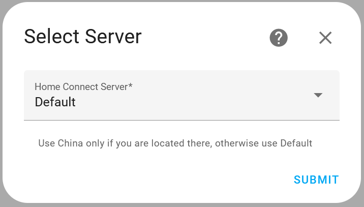
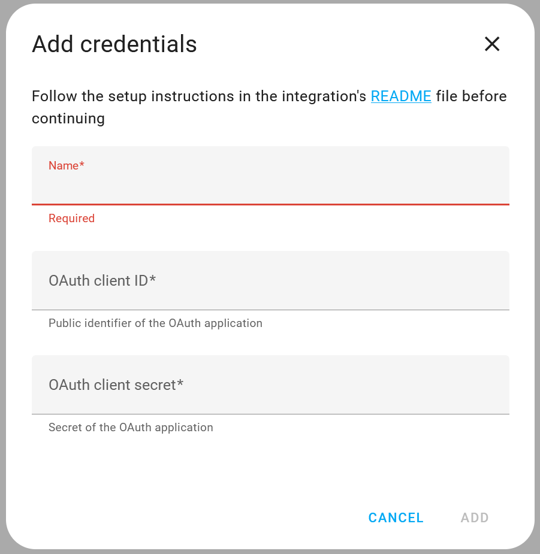

# Personal note
  
Normally this section wouldn't exist here. However, on Oct. 7th Israel was attacked by Hamas, the terrorist organization that controls the Gaza strip. They invaded dozens of border communities, murdered, raped, burned, tortured and mutilated nearly 1400 Israelis and kidnapped at least another 200. Most of them civilians, including women, children, elderly and people with disabilities. The atrocities they committed are unspeakable, but the scope of affected people is actually much larger than those directly murdered or kidnapped. There are thousands of survivers, victim's families and over 100,000 people who were displaced from their homes due to constant rocket attacks. As an Israeli, I am spending most of my time since the massacre volunteering to help the victims as best I can, so expect my response time here to be longer than usual.

Since I started this project some of you offered to buy me coffee as a token of appreciation, I always refused because I'm doing it for fun, but if you still want to show your support, a donation to the [Brothers and Sisters for Israel](https://www.brothersandsistersforisrael.org/) organization would be a great place to do that. This organization formed about 10 months ago, as a part of a coalition of pro-democracy civil organizations in Israel, protesting against the government's "judicial reform", which was meant to remove most checks and balances from the government and give it unchecked power, as happened in other countries such as Hungary. At this time of crisis the organization has transformed its infrastructure to a full fledged civic support and relief organization and is a worthy recipient of donations. 

I hope the ISIS-like Hamas terrorist organization, who is responsible for the killing of countless Israelis and Palestinians, will soon be destroyed, peace will be restored and both parties can be free to build a better future.

[DONATION LINK](https://www.brothersandsistersforisrael.org/)

P.S. If you don't like this note then a) check your morale compass and b) feel free to not use this integration. 

</br>
</br>

# Alternative Home Connect Integration for Home Assistant
This project is an alternative integration for Home Connect enabled home appliances manufactured by BSH under the Bosch, Siemens, Constructa and Neff brands.

*If you're using this integration please star it on Github*

</br>

# Table of contents
<!-- TOC start (generated with https://github.com/derlin/bitdowntoc) -->

- [Main features](#main-features)
- [Installation instructions](#installation-instructions)
   * [Creating a Home Connect developer app](#creating-a-home-connect-developer-app)
   * [Installing the integration](#installing-the-integration)
      + [Pre-installation steps](#pre-installation-steps)
      + [Installation](#installation)
- [Configuration options](#configuration-options)
   * [Options settable in the UI](#options-settable-in-the-ui)
      + [Regular options](#regular-options)
      + [Advanced options](#advanced-options)
   * [Options settable in configuration.yaml:](#options-settable-in-configurationyaml)
- [Automation Notes](#automation-notes)
   * [Integration state](#integration-state)
   * [Services](#services)
   * [Events](#events)
   * [Triggers](#triggers)
   * [Local vs. Server translation](#local-vs-server-translation)
- [Troubleshooting and FAQ](#troubleshooting-and-faq)
- [Known Issues](#known-issues)
- [Reporting issues / bugs](#reporting-issues-and-bugs)
    + [Bug report requirements](#bug-report-requirements)
    + [Enabling debug logging](#enabling-debug-logging)
    + [Setting Log Mode](#setting-log-mode)
- [Beta Releases](#beta-releases)
- [Contributing Translations](#contributing-translations)
- [Legal Notice](#legal-notice)

<!-- TOC end -->

# Main features
Home Assistant already has a built-in integration for Home Connect, however, it is quite basic, generates entities that are not always supported by the connected appliances and tends to stop getting status updates after a while.
This integration attempts to address those issues and has the following features:
* All the entities are dynamically read from the API and reflect true capabilities of the appliance.
* The integration exposes entities that provide complete control over programs, program options, and global settings. These entities are dynamically read from API and therefore are specifically applicable to the connected appliances.
* Configurable options and settings are exposed for easy selection using "Select", "Switch" or "Number" entities, as appropriate.
* Read only status values, as well as some selectable options are also made available either using "Sensor" or "Binary Sensor" entities for easier use when only wanting to display them.
* Status events that are published by the Home Connect service are exposed as Home Assistant events.
* "Program Started" and "Program Finished" events are exposed as triggers for easier building of automation scripts.
* A "Start Program" Button entity is provided to start the operation of the selected program.
* Program and option selections are also available as a service for easier integration in scripts.
* The state of all entities is updated in real time with a cloud push type integration.
* Clean handling of appliances disconnecting and reconnecting from the cloud.
* Clean handling of new appliances being added or removed from the service.
* All the names support translation, but currently only the English translation is provided.
* Using pure async implementation for reduced load on the platform.

</br>

# Installation instructions
## Creating a Home Connect developer app
Before installing the integration you need to create an "application" in the Home Connect developers website. Note that if you have an existing appliacation, that was created before July 2022 you will most likely have to update the redirect URI to the one specified below. It can take a few hours for the changes to existing applications to apply, so be patiant.

1. Navigate to the "[Applications](https://developer.home-connect.com/applications)"
   page on the Home Connect developers website. You'll be prompted to create an account or sign in if you already have one.  
   **➠ NOTE: You MUST use ONLY lowercase letters in the email addresses of both your regular user account and developer account or the integration won't work!**
2. Click the "[Register Application](https://developer.home-connect.com/applications/add)" link.
3. Fill in the application creation form:  
   **Application ID**: A unique ID for the application, can be home-connect-alt, or whatever you like.  
   **OAuth Flow**: Authorization Code Grant Flow  
   **Home Connect User Account for Testing**: Leave blank  
   **Redirect URI**: https://my.home-assistant.io/redirect/oauth  
   **Add additional redirect URIs**: Leave unchecked  
   **Enable One Time Token Mode**: Leave unchecked  
4. Click "Save" then copy the *Client ID* and *Client Secret* and save them for use in the next step.

## Installing the integration

### Pre-installation steps
1. Navigate to https://my.home-assistant.io/ and make sure the Home Assistant Instance
   is configured correctly to point to your local Home Assistant instance.
2. Power on all your appliances.
3. Turn **OFF** the wifi on your phone and make sure all the appliances are operational in the Home Connect mobile app.
4. If this is **not** the first time you are installing the integration and anything changed with your credentials you should go the the Settings -> Devices & Services page on Home Assistant, then click the three-dot-menu on the top righthand corner and select "Application credentials". Locate the previous credentials row for this integration and delete it.

### Installation
1. The esiest way to install the integration is using HACS. Just click the
   button bellow and follow the instructions:
   [](https://my.home-assistant.io/redirect/hacs_repository/?owner=ekutner&repository=home-connect-hass)  
   Alternatively, go to Settings -> Devices & Services in Home Assistance and click the "Add Integration" button. Search for "Home Connect Alt" and install it.
2. A dialog box will popup asking you to select your preferred Home Connect server. 
   Select "China" if you are located in China and "Default" for any other location.
   
3. Next you will be asked to provide the Home Connect developer app credentials you 
   created erlier. Give these credetials set a name that will make it easy for you to reference them in the Home Assistant credentials manager :
   

4. Finnaly, a new window will popup where you will be asked to login to to your Home Connect
   account and allow Home Assistant to access your appliances. After you approve that you will be redirected back to Home Assistant, continue as instructed.
5. Congratulations, you're done!  
   Home Connect Alt will now start downloading the data for your
   appliances and will add the entities for them to Home Assistant.  
   Note that the integration dynamically discoveres entities as they are made available by the API, so expect new entities to be added in the first few uses of the appliances.

# Configuration options
Starting with version 0.7.0 the integration supports the UI configuration flow for most configuration options. Existing config values will be read however, once the options are saved in the UI they will override the values from the config file.

## Options settable in the UI
### Regular options
These options will show up for all users.
* **Language** (optional - default = "en") - 
  Indicates the language to use for entity names and values. The translation is automatically loaded from the Home Connect service and must  be one of its [supported languages](https://api-docs.home-connect.com/general?#supported-languages).

* **Translation Mode** - 
  Indicates how sensor values and select boxes should be translated to friendly names:  
  * **Local** - The integration will use the raw ENUM values documented in the Home Connect documentation for sensors with string values. In that case the integration relies on the Home Assistant translation mechanism and translation files to translate these values into friendly names. The benefit of this approach is that the values used by the integration are language independent and match the values documented in the Home Connect API.  
  * **Server** - Sensor values are translated to friendly names using the Home Connect service. In this mode the internal values of string sensors will be translated and the translated values must be used in scripts referring to those sensors.

### Advanced options
These options will only show up when the user has enablde "Advanced mode" in the user profile.
* **Name Template**  - 
  Defines the template used for rendering entity names. The following placeholders are supported and will be replaced dynamically when rendering the name:  
  $brand - The brand name of the appliance ("Bosch", "Siemens", etc.)  
  $appliance - The type of the appliance ("Washing machine", "Dishwasher", etc.)  
  $name - The name of the entity   
  The default template is "$brand $appliance - $name"

* **Log mode** - 
  Defines the log verbosity level. Should normally be set to 0. Don't change this unless asked to do so while working on a bug you reported.

## Options settable in configuration.yaml:
These very advanced options are only settable in the configuration.yaml file.
Generally you should not change them unless you know what you're doing.

```
home_connect_alt:
  appliance_settings: <custom appliance settings>
  entity_settings:  <custom entity settings>
```

* **appliance_settings** (optional) - Overrides some settings for specific appliances.    
  This setting requires specifying the identifier (HAID) of the appliance. The easiest way to find it is to look at the entity ID of the "Connected" sensor of the appliance. 
  This would look something like ```binary_sensor.bosch_wat286h0gb_68a64f51deb_connected```, and the ID in this case is ```bosch_wat286h0gb_68a64f51deb```.

  Currently supported settings:  
  **_name_template_** - override the global name_template setting  
  **_disabled_** - set to *true* to disable loading the specified appliance (default=false)

  For example:
  ```
  appliance_settings:
    bosch_wat286h0gb_68a64f51deb:
      name_template: My appliance $name
      disabled: false
  ```

* **entity_settings** (optional) - Overrides internal entity settings.  
  Currently supported settings to override are:  
  **_unit_**: The units to use for numeric values  
  **_icon_**: The [Material Design icon](https://pictogrammers.com/library/mdi/) to use for the entity in the format "mdi:\<icon name>  
  **_class_**: The Home Assistant class of the entity (must be a class which is already supported for that entity type)
  For example:
  ```
  entity_settings:
    ConsumerProducts.CoffeeMaker.Status.BeverageCounterCoffee:
      unit: cups
      icon: mdi:coffee
  ```

After the integration is configured READ THE FAQ then add it from the Home-Assistant UI.

<br>

# Automation Notes

## Integration state
* There is a special sensor called **Home Connect Status** which shows the status of the integration. It has the following values:
  * INIT - The integration is initializing
  * RUNNING - The integration has started running
  * LOADED - The integration finished loading the initial data from the Home Connect service
  * READY - The integration has successfully subscribed to real time updates from the cloud service and is now fully functional.
  * BLOCKED - The Home Connect service has blocked additional API calls for a period of time due to exceeding the service rate limits
  *It may take up to one minute to go from LOADED to READY*

## Services
The following services are available for use with automations:  
**select_program** - Selects a program and optionally set its options  
**start_program** - Starts a program and optionally set its options  
**stop_program** - Stops the active program  
**pause_program** - Pauses the active program (if and when supported by the appliance)  
**resume_program** - Resumes a paused program (if and when supported by the appliance)  
**set_program_option** - Sets an option on the active program if one exists or on the selected program otherwise  
**apply_setting** - Applies the sepecified setting on an appliance  
**run_command** - Runs the specified command on an appliance  

## Events
The integration exposes the events fired by the service as Home Assistant events under the name: **"home_connect_alt_event"**  
The published events values are:  
* **BSH.Common.Status.OperationState**  
* **All the events with the keyword "Event" in their names**

## Triggers
The integration exposes two triggers for easy automation:
  * program_started
  * program_finished

## Local vs. Server translation
The default behavior of this integration is to use "local" value translation. That means that all string sensors keep their internal value in a raw, language independant format. Those values are "translated" in the UI to a human friendly text by using local translation files.  
This method is different than most other Home Assistant integration but it has three important benefits:
1. It makes automation code language independent. As a developer I strongly believe that code shouldn't relay on the specific human language currently selected by the user.
2. It allows users to look up possible values in the Home Connect developer documentation. So you can know in advance which values to epxect for a given sensor.
3. It allows add translation for languages which are not supported by the Home COnnect API.

In contrast, setting ```sensor_value_translation: server``` will override this behavior and use translations provided by the Home Connect API. This is limited to languages supported by the API but it does make sensor have the actual textual values displayed in the UI. So you can use that if you prefer,

</br>

# Troubleshooting and FAQ
* **I don't get the installation dialogs mentioned in the [Installation](#installation) section above**  
  These dialogs will only show up the first time you install the integration and only if you do not have the *client_id* and *client_secret* configured in your configuration.yaml file.
  The make it appear again make sure the integration is uninstlled, then go to the *Settings -> Devices & Services* page on Home Assistant, then click the three-dot-menu on the top righthand corner and select "Application credentials". Locate the previous credentials row for this integration and delete it.
* **I get errors on the browser window that pops-up after installing the integration for the first time**  
  This popup window is trying to log you into the Home Connect website to establish a connection with the integration. If you get an error at this stage it means you didn't follow the setup instuctions carefully enough, so make sure that you do.
  Also make sure that you open https://my.home-assistant.io/ and configure the URL of your Home-Assistant server.  
  **NOTE:** If you are modifying an existing Home-Connect App then it may take up to 2 hours for the changes to take effect, so make sure you wait long enough.

* **Some of my appliances are not showing up after I added the integration**  
  This is most commonly caused by two reasons:
  1. The appliance must be powered on and connected to the Home Connect service to be discovered. Once the missing devices are turned on and connected, they will automatically be discovered and added by the integration.
  This can be verified in the Home Connect mobile app **but only while the wifi on the phone is turned OFF**. If the devices are active in the mobile app while the phone's wifi is turned off then please open an issue with a debug log to report it.
  2. Due to some unreasonable rate limits set by BSH, there is a limit of about 3
  appliances loaded per minute. If you have more, expect the initial load to take longer. The integration will wait for the service to become available and continue loading the rest of the appliances. You may have to refresh your screen to see them in Home Assistant after they were added.

* **The Home Connect mobile app has some controls/data/events that are missing in Home Assistant**  
  This integration doesn't know anything about any specific appliance, it is using the official Home Connect API to explore the available options for each appliance and automatically exposes them as appropriate Home Assistant entities. The type of entities is automatically determined by information received from the API. The Home Connect mobile app is using a private API that is not available to the public and has more capabilities than those in the official API. Therefor it is expected that there will be some data, controls or events that are available in the app but not in the integration, this is NOT a problem with the integration but a limitation of the API.
  **DO NOT open bugs or feature requests related to such issues unless you can demonstrate that the missing item is actually available in the API**

* **I've restarted Home Assistant a few times and now all my appliances are unavailable**  
  This is, again, related to the Home Connect rate limits. Every time you restart Home Assistant the integration makes a few API calls to the service and if that happens too often it may block for up to 24 hours. The best way to fix this is to wait a day and restart Home Assistant again.

* **I select a program or option but nothing happens on the appliance**  
  Make sure the appliance is turned on. Typically the integration will automatically detect appliances that are turned off or disconnected from the network and disable them in Home Assistant but it may happen that it fails to detect that and then attempting make any changes to setting will fail.

* **I try to start the selected program by pressing the button but nothing happens**  
  Make sure Remote Start is enabled on the appliance

* **Sensor related to program progress are showing up as unavailable**  
  These sensors only become available when the appliance is running a program.

* **All the program, option and settings selection boxes, switches and numbers are disabled**  
  Make sure that *Remote Control* is allowed on the appliance. It is typically enabled by default but gets temporarily disabled when changing setting on the appliance itself.

* **The *Start* button is disabled**  
  Make sure that *Remote Control Start* is allowed on the appliance, it's disabled by default.

* **Sensor values or select boxes have values like BSH.Common.EnumType.PowerState.Off**  
  Start by reading where these values are coming from in the explanation of the *sensor_value_translation* config param above. You can also set that parameter as a workaround for missing translations in sensor values.
  Regardless if you decide to use the language parameter or not it would be great if you can report these values so they can be properly translated. Ideally, if you know how, please update the translation files directly (at least the English ones) and create a PR. If you don't know how then you can add them to issue [#26](https://github.com/ekutner/home-connect-hass/issues/26) and I will add them to the translation files.

  **_Note:_** It is expected to see these values in sensor history data. This is currently a limitation/bug in Home Assistant which doesn't translate these values.

* **Home Assistant display "Error" popup after installing the integration and completing the login flow to Home Connect**  
  When this issue occurs the log file will show a "Bad Request" "400" error.  
  Make sure the email address you used when registereting your Home Connect account has ONLY lowercase letters.

</br>

# Known Issues
* If you have more than 3 connected devices (or you just play a lot with settings), you may hit the daily API rate limit set by the Home Connect API. The limit is set to 1000 calls per day and when it is hit the API is blocked for 24h. During that time, the integration will not get updated with new states and you won't be able to select and options or start a program.
If you hit this limit frequently, please open an issue with a debug log. I'll try to see if there is a way to reduce some calls. However, as of now, there is nothing I can do about it and the Home Connect team was unwilling to increase this limit, which hurts their best customers so there is nothing I can do about it.

</br>

# Reporting Issues and Bugs
**CAREFULLY** Read the [FAQ](#troubleshooting-and-faq) before submitting a bug report or opening a feature request, a lot of common issues are already covered there.

**DO NOT** open bugs or feature requests on missing data, controls or events, unless you can show, either in the logs or in the API documentation that the missing item is actually available. Read the [FAQ](#troubleshooting-and-faq) section for more details on this.

### Bug report requirements
All non trivial issues require:
* A click on the **Home Connect Debug Info** button that the intgration is adding to the Home Assistant default "Overview" dashboard. This will dump some critical state information to the log.
* A full debug log. See next section for instructions how to enable debug logging.
* In some cases, while working on an issue, I will ask you to set a specific *Log Mode*, see below how to do that.

### Enabling debug logging
Use one of these two methods enable debug logging:
* In Home Assistant navigate to *Settings → Devices & Services → Home Connect Alt* 
  and click on "*Enable debug logging*".  
  If you are using this method you can click "*Disable debug logging" when you're done to download the log file which you'll have to attach to your bug report.

  -OR-

* Add the following to your configuration.yaml file then restart HA:
  ```
  logger:
    default: warn
    logs:
      home_connect_async: debug
      home_connect_alt: debug
      custom_components.home_connect_alt: debug
  ```
  If you're using this method you will have to download the log directly from the Home Assistant server in order to attach it to the bug report.

### Setting Log Mode
If while analyzing an issue you reported you are requested to set a specific **Log Mode**:
1. Make sure that "Advanced mode" is enabled in your Home Assistant profile.
2. In Home Assistant navigate to *Settings → Devices & Services → Home Connect Alt*
3. Press the "CONFIGURE" button and set the required log mode.


</br>

# Beta Releases
Major changes will be released in beta versions to reduce the impact on existing users. It is strongly advised not to install the beta version unless you are a part of an issue that specifically calls for installing one and when you are, you should only install the specified version (as there may be several issues handled in separate beta versions at the same time).
To install a beta version go to the HACS dashboard in the Home Assistant UI:
* Click on Integrations locat the "Home Connect Alt" integration.
* Click on the three dot menu for the integration and select "Redownload".
* In the popup dialog make sure "Show beta versions" is enabled and then select the version you need to install.

<br>

# Contributing Translations
You are welcome to create PRs for new language translations or updates to existing ones however please note the following requirements:
* To add a new language translation **always** start by copying the English translation file and edit it.
* New ENUM value translations **will not be accepted** if they are not added to the English translation file first.
* Translations **MUST** be added and modified **ONLY** under the "entity.sensor" node of the translation file because those values will also be used to automatically overwrite the values under the "enity.select" node.
* The translated ENUM values must be added in the correct section (programs/options/settings/statuses)

<br>

# Legal Notice
This integration is not built, maintained, provided or associated with BSH in any way.
